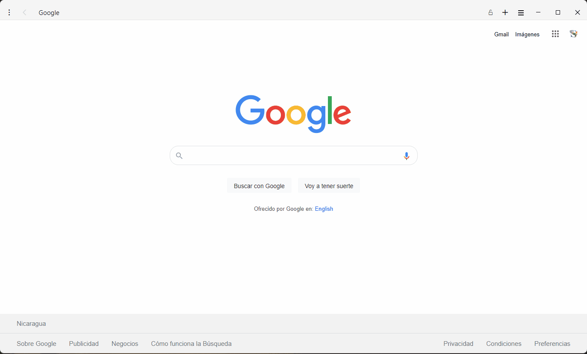

 

  <h3 align="center">Google Home Clone</h3>

  

    Práctica de HTML5 y CSS
  

## Acerca de la Práctica

Segundo ejercicio práctico enfocado en Variables CSS, Media Queries y uso de Display Flex.

El uso del display se está realizando únicamente con:
* Flexbox

Para este ejercicio intencionalmente se evitó utilizar display grid.
